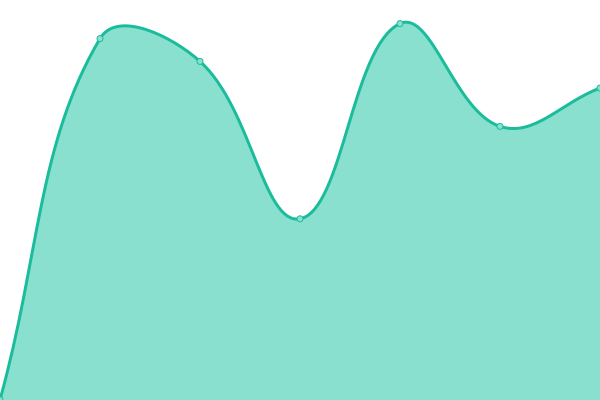

# [📈 Live Status](https://status.tr1cky.au): <!--live status--> **🟥 Complete outage**

This repository contains the open-source uptime monitor and status page for the [Laser Sports Archive](https://archive.lasersports.au), powered by [Upptime](https://github.com/upptime/upptime).

With [Upptime](https://upptime.js.org), you can get your own unlimited and free uptime monitor and status page, powered entirely by a GitHub repository. We use [Issues](https://github.com/dorwardtech/status/issues) as incident reports, [Actions](https://github.com/dorwardtech/status/actions) as uptime monitors, and [Pages](https://status.tr1cky.au) for the status page...

<!--start: status pages-->
<!-- This summary is generated by Upptime (https://github.com/upptime/upptime) -->
<!-- Do not edit this manually, your changes will be overwritten -->
<!-- prettier-ignore -->
| URL | Status | History | Response Time | Uptime |
| --- | ------ | ------- | ------------- | ------ |
|  [Laser Sports Archive](https://archive.lasersports.au) | 🟥 Down | [laser-sports-archive.yml](https://github.com/DorwardTech/lsa-status/commits/HEAD/history/laser-sports-archive.yml) | 

 1505ms
     
 | 

<a href="https://status.lasersports.au/history/laser-sports-archive">99.00%</a>
    

|  Laser Sports Archive - API | 🟥 Down | [laser-sports-archive-api.yml](https://github.com/DorwardTech/lsa-status/commits/HEAD/history/laser-sports-archive-api.yml) | 

 273ms
     
 | 

<a href="https://status.lasersports.au/history/laser-sports-archive-api">100.00%</a>
    

<!--end: status pages-->

[**Visit our status website →**](https://status.lasersports.au)

## 📄 License

- Powered by: [Upptime](https://github.com/upptime/upptime)
- Code: [MIT](./LICENSE) © [Robert Dorward](https://tr1cky.au)
- Data in the `./history` directory: [Open Database License](https://opendatacommons.org/licenses/odbl/1-0/)
